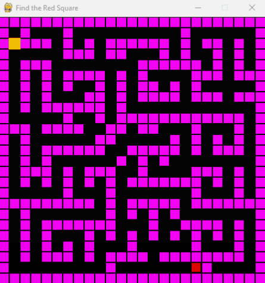

# Exhaustive Search vs. Topological Order in Directed Acyclic Graphs (DAGs)
## Maze
The maze is represented in the `level.py` file and must NOT contain any cycles.

## Exhaustive Search
This implementation of exhaustive paths prefers to explore paths to its left, then up, then down, then finally right. 

## Topological Order
Since DAGs have no cycles, we simply iterate through the DAG until a path is found. The path is determined in advance as to not delay the PyGame path finding animation.

## Path Visualization

