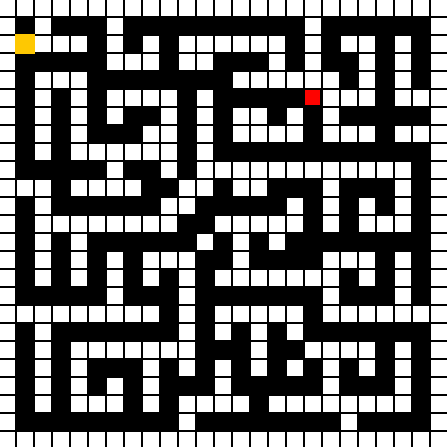

# Path Finding Algorithms
## A* vs. Topological Search vs. Exhaustive Search
- A*: finds the shorest path through the maze, beginning at the starting coordinate and finishing at the ending coordinate. It evaluates each path through the maze against a heuristic to determine the most optimal path.
- Topological Search: finds a path through the maze, beginning at the starting coordinate and finishing at the ending coordinate. To do this, it generates a directed-acyclic graph from the maze (level), then iterates through it until a path is found.
- Exhaustive Search: tries to find any solution through the maze by exploring all tiles. From it's position at any time, it will prefer to explore new paths to it's left, then upwards, then downwards, and finally to it's right.
 
## Path Visualization
Legend: 
- A* (BLUE) 
- Topological Search (GREEN) 
- Exhaustive Search (YELLOW)

    

